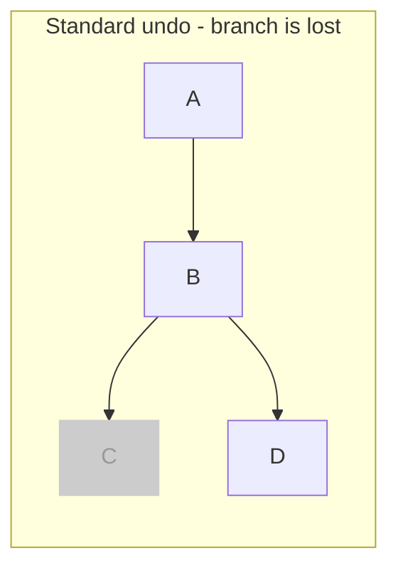
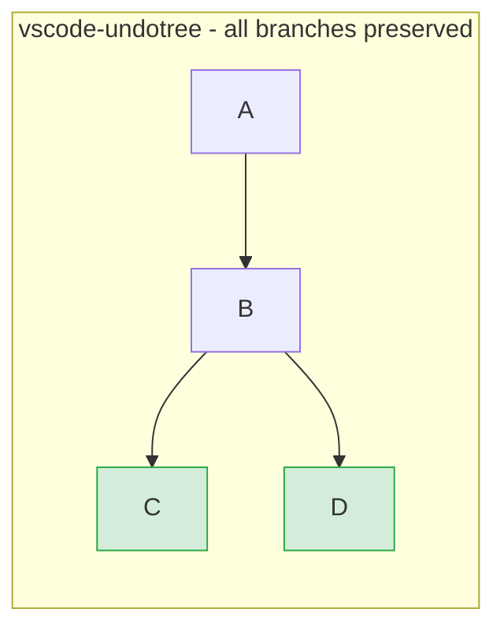
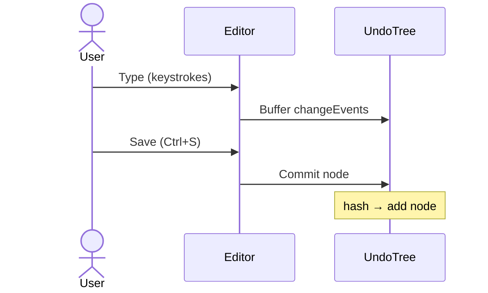
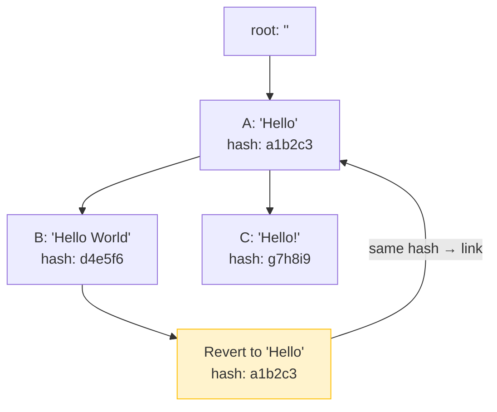
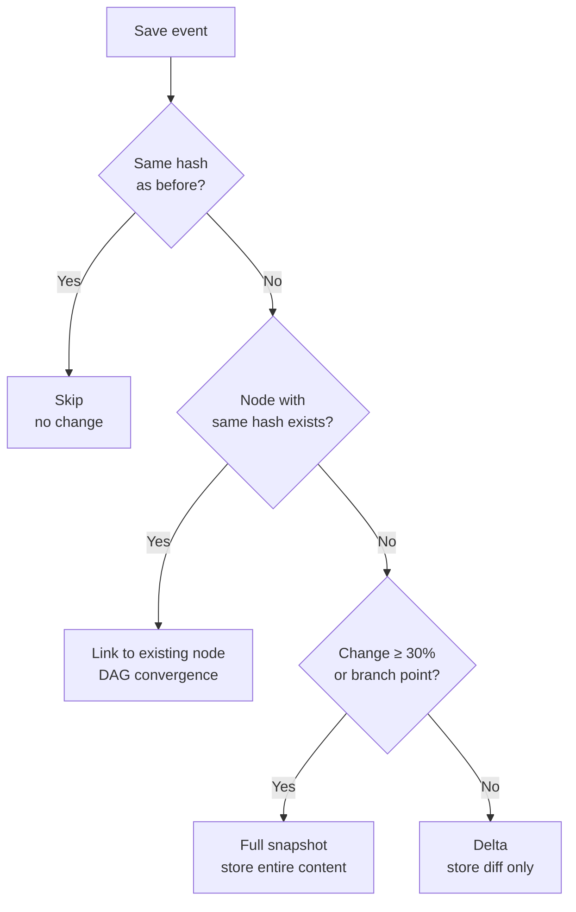
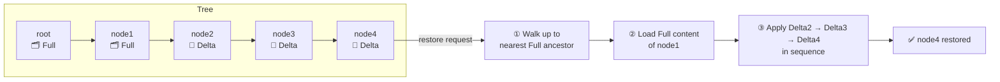

# vscode-undotree

Visualize and navigate your undo history as a tree in VS Code.

[日本語はこちら](./README_ja.md)

## Overview

Unlike standard linear undo/redo, **vscode-undotree** preserves all editing branches. When you undo and make a new edit, your previous "future" is not lost — it remains as a separate branch you can return to at any time.


## Features

- **Tree-structured undo history** — All branches are preserved, never discarded
- **Save-triggered checkpoints** — History nodes are created on every save (`Ctrl+S`), giving you intentional, meaningful snapshots
- **Periodic autosave** — Automatically creates a checkpoint every 30 seconds if the content has changed
- **DAG deduplication** — If you return to previously saved content, the tree links to the existing node instead of creating a duplicate, with cycle detection to prevent infinite loops
- **Hybrid storage** — Small changes are stored as lightweight diffs; large changes and branch points are stored as full snapshots
- **Sidebar panel** — Visualize the full history tree in the Explorer sidebar; click any node to jump to it directly
- **Selective tracking** — Only tracks configured file extensions (default: `.txt`, `.md`); toggle per-extension from the status bar
- **Pause / Resume** — Temporarily freeze history recording without losing the existing tree

## Installation

This extension is distributed as a `.vsix` file via [GitHub Releases](https://github.com/mmiyaji/vscode-undotree/releases).

1. Go to the [Releases page](https://github.com/mmiyaji/vscode-undotree/releases) and download the latest `.vsix` file.
2. Open VS Code.
3. Open the Command Palette (`Ctrl+Shift+P`) and run `Extensions: Install from VSIX...`.
4. Select the downloaded `.vsix` file.

## Usage

| Action | Method |
|--------|--------|
| Open Undo Tree panel | Sidebar → Explorer → **Undo Tree** |
| Focus panel | `Ctrl+Shift+U` |
| Create checkpoint | Save the file (`Ctrl+S`) |
| Undo / Redo | Click **↑ Undo** / **↓ Redo** in the panel |
| Jump to any node | Click the node row in the panel |
| Pause / Resume tracking | Click **⏸ Pause** / **▶ Resume** in the panel |
| Open settings | Click **⚙** in the panel |
| Enable / disable current extension | Click the status bar item |

### Panel layout

```
↑ Undo  ↓ Redo  ⏸ Pause  ⚙
────────────────────────────────
● initial                 00:00:00
  ● F  save               00:01:05   ← F = Full snapshot
    ● D  save             00:02:30   ← D = Delta (diff only)
    │ ● D  auto           00:03:00
    ● D  save             00:04:12   ◀ current
```

- The **ringed dot** (◎) marks the current position.
- `F` = full content stored; `D` = diff only.
- A dashed edge (---) in the tree indicates a DAG convergence link.

### Status bar

The status bar item (bottom right) shows the tracking state of the current file:

| Display | Meaning |
|---------|---------|
| `$(history) Undo Tree: ON` | Current extension is tracked |
| `$(circle-slash) Undo Tree: OFF` | Current extension is not tracked — click to enable |
| `$(debug-pause) Undo Tree: PAUSED` | Tracking is paused globally — click to toggle |

Hover over the item to see the detected extension and the full enabled list.

## Configuration

Open settings via the **⚙** button in the panel, or search for `undotree` in VS Code settings.

| Setting | Default | Description |
|---------|---------|-------------|
| `undotree.enabledExtensions` | `[".txt", ".md"]` | File extensions to automatically track |
| `undotree.excludePatterns` | `[]` | Filename patterns to exclude (supports `*` wildcard) |

**Examples:**

```json
// Track additional extensions
"undotree.enabledExtensions": [".txt", ".md", ".js", ".ts"]

// Exclude minified files and changelogs
"undotree.excludePatterns": ["*.min.*", "CHANGELOG*"]
```

## Design Philosophy

### Linear undo vs. vscode-undotree

With standard undo, making a new edit after undoing permanently discards your previous "future":



vscode-undotree preserves all branches:



### Save as a meaningful checkpoint

Most undo tree implementations track every keystroke. This creates noise and makes the history hard to navigate. vscode-undotree uses **file saves as the unit of history**, the same mental model as git commits.



### Content-addressed deduplication (DAG)

Each node is identified by a SHA-1 hash of its content. Reverting to a previously saved state links back to the existing node instead of duplicating it. A cycle check (`isAncestor`) prevents the graph from becoming circular.



### Hybrid storage: delta and full snapshots



### Restoring any node



### No interference with VS Code's native undo

vscode-undotree operates alongside VS Code's built-in undo stack. It does not replace or intercept the native undo mechanism. The tree is a separate layer for navigating between save checkpoints.

## Requirements

- VS Code 1.90.0 or later

## License

MIT
