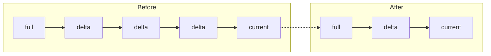
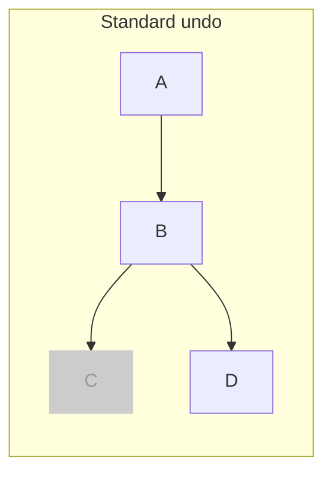
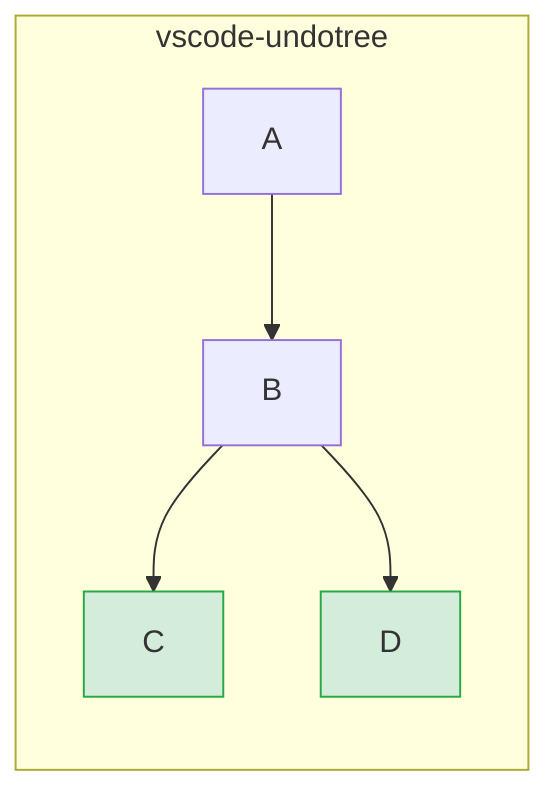
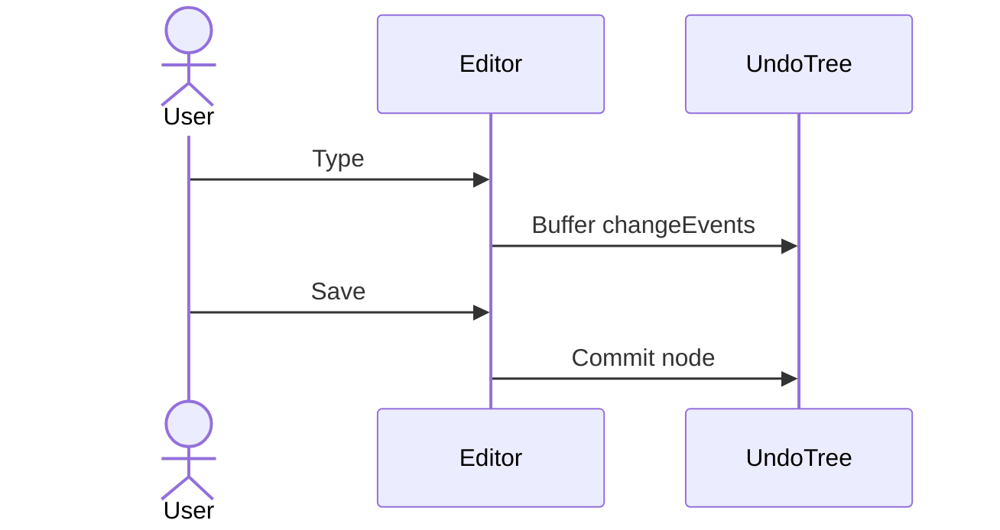
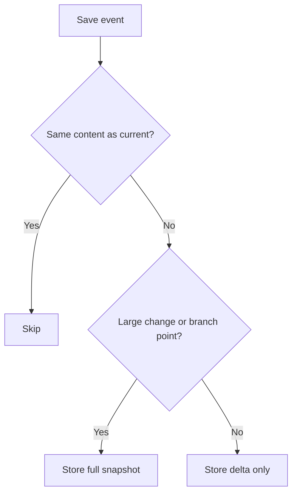
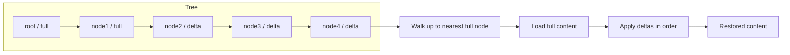

# vscode-undotree

Visualize and navigate save-based undo history as a tree in VS Code.

[Japanese README](./README_ja.md)

## Overview

Unlike standard linear undo/redo, **vscode-undotree** preserves editing branches. When you undo, move to an older node, and continue editing, your previous future is kept as another branch you can return to later.

The tree is based on file saves and periodic autosave checkpoints. It does not replace VS Code's native undo stack; it adds a separate history layer for navigating meaningful states.


## Features

- **Tree-structured undo history**: Branches are preserved instead of discarded
- **Save-triggered checkpoints**: History nodes are created on every save
- **Periodic autosave**: Creates a checkpoint every 30 seconds when content changed
- **Hybrid storage**: Small changes are stored as diffs; larger changes and branch points are stored as full snapshots
- **Sidebar panel**: Visualize the history tree and click nodes to jump
- **Diff mode**: Compare any node with the current document
- **Selective tracking**: Track only configured extensions and exclude matching files
- **Pause / Resume**: Temporarily stop history capture without losing the tree
- **Persisted history**: Save, restore, and reload tracked trees across sessions
- **Compaction**: Reduce noise in long linear chains without removing branch points

## Installation

This extension is distributed as a `.vsix` file via [GitHub Releases](https://github.com/mmiyaji/vscode-undotree/releases).

1. Go to the [Releases page](https://github.com/mmiyaji/vscode-undotree/releases) and download the latest `.vsix` file.
2. Open VS Code.
3. Open the Command Palette (`Ctrl+Shift+P`) and run `Extensions: Install from VSIX...`.
4. Select the downloaded `.vsix` file.

## Usage

| Action | Method |
|--------|--------|
| Open Undo Tree panel | Sidebar -> Explorer -> **Undo Tree** |
| Focus panel | `Ctrl+Shift+U` |
| Create checkpoint | Save the file (`Ctrl+S`) |
| Undo / Redo | Click **Undo** / **Redo** in the panel |
| Jump to any node | Click the node row in the panel |
| Compare with current | Switch to **Diff** mode and click a node |
| Pause / Resume tracking | Click **Pause** / **Resume** in the panel |
| Open actions menu | Click the settings button in the panel |
| Enable / disable current extension | Click the status bar item |

### Panel layout

```
Undo  Redo  Pause  Diff  [menu]
────────────────────────────────
● initial                 00:00:00
● save   F                00:01:05   ← F = Full snapshot
└─ ● save   D             00:02:30   ← D = Delta (diff only)
● auto   D                00:03:00
● save   D                00:04:12   ◀ current
```

- The highlighted row is the current position.
- `F` means full content is stored.
- `D` means only diffs are stored.
- Branch lines are drawn with SVG connectors in the sidebar.

### Status bar

The status bar item in the lower right shows the tracking state of the current file:

| Display | Meaning |
|---------|---------|
| `$(history) Undo Tree: ON` | Current extension is tracked |
| `$(circle-slash) Undo Tree: OFF` | Current extension is not tracked; click to enable |
| `$(debug-pause) Undo Tree: PAUSED` | Tracking is paused globally; click to toggle |

Hover over the item to see the detected extension, enabled list, and exclude state.

### Actions menu

The settings menu includes:

- `Open Settings`
- `Save Persisted State`
- `Restore Persisted State`
- `Compact History`
- `Pause Tracking` / `Resume Tracking`
- `Toggle Tracking for This Extension`

## Persistence

Persisted history is stored in the extension storage directory, not in your workspace by default.

Saved data is split per tracked file:

- `undo-trees/manifest.json`
- `undo-trees/<file-hash>.json`

Behavior:

- `Save Persisted State` writes the current tracked trees to disk
- `Restore Persisted State` reloads the saved tree for the active file
- Opening a tracked file reloads its saved tree on demand
- If the file content differs from the saved current node, a new `restore` node is appended
- Pause state is also persisted

## Compaction

`Compact History` reduces noise in long linear chains by removing compressible middle nodes.

Current behavior:

- Only simple middle nodes in a straight chain are removed
- Branch points are kept
- Leaf nodes are kept
- The current node is kept
- Mixed-content nodes are kept

Here, `mixed` means a node that is not part of a pure insert-only chain or pure delete-only chain. Full snapshot nodes are treated as `mixed`, and delta nodes that contain both insertion and deletion are also treated as `mixed`, so they are excluded from compaction.



## Configuration

Open settings from the actions menu, or search for `undotree` in VS Code settings.

| Setting | Default | Description |
|---------|---------|-------------|
| `undotree.enabledExtensions` | `[".txt", ".md"]` | File extensions to automatically track |
| `undotree.excludePatterns` | `[]` | Filename patterns to exclude (supports `*` wildcard) |
| `undotree.persistenceMode` | `"manual"` | `manual` saves only when requested; `auto` saves automatically after history changes |

**Examples:**

```json
{
  "undotree.enabledExtensions": [".txt", ".md", ".js", ".ts"],
  "undotree.excludePatterns": ["*.min.*", "CHANGELOG*"],
  "undotree.persistenceMode": "auto"
}
```

## Design Philosophy

### Linear undo vs. vscode-undotree

With standard undo, making a new edit after undoing permanently discards your previous future:



vscode-undotree preserves both paths:



### Save as a meaningful checkpoint

Many undo tree tools record every keystroke. That quickly becomes noisy. vscode-undotree uses **file saves as the main unit of history**, which produces a tree closer to how people think about meaningful editing states.



### Hybrid storage: delta and full snapshots



For compaction purposes, nodes are also classified as `insert`, `delete`, or `mixed`:

- `insert`: delta node with insert-only changes
- `delete`: delta node with delete-only changes
- `mixed`: full snapshot nodes, or delta nodes that contain both insertion and deletion

Branch points are upgraded to full snapshots so each branch remains reconstructable.

### Restoring any node



### Persisted state and restore-on-open

Persisted trees are saved per file. When a tracked file is opened again, its saved tree is loaded on demand. If the on-disk file content differs from the saved current node, the extension appends a `restore` node so the tree stays consistent with the actual document state.

### No interference with VS Code's native undo

vscode-undotree operates alongside VS Code's built-in undo stack. It does not replace or intercept the native undo mechanism. The tree is a separate layer for navigating between save checkpoints.

## Requirements

- VS Code 1.90.0 or later

## License

MIT
