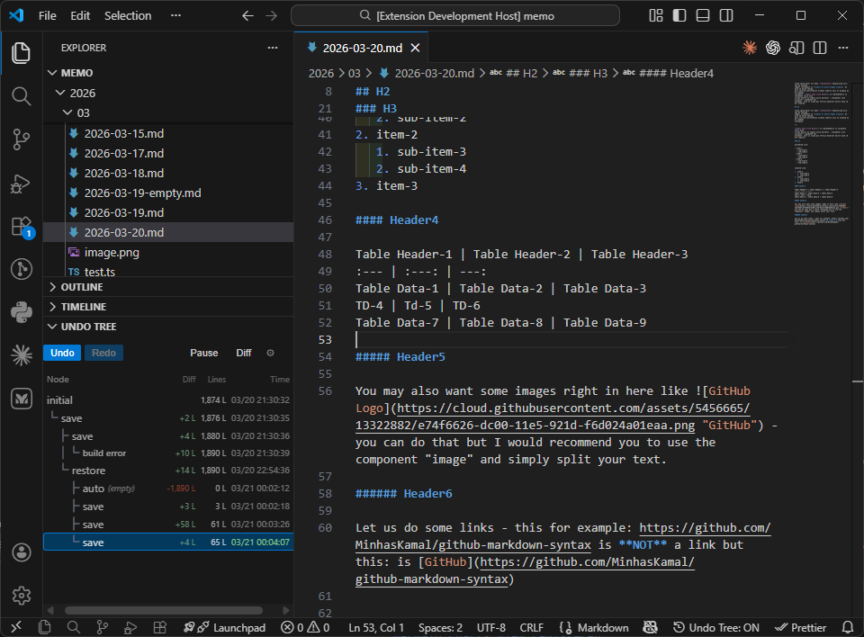
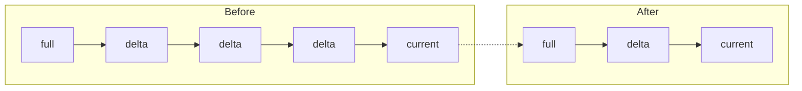
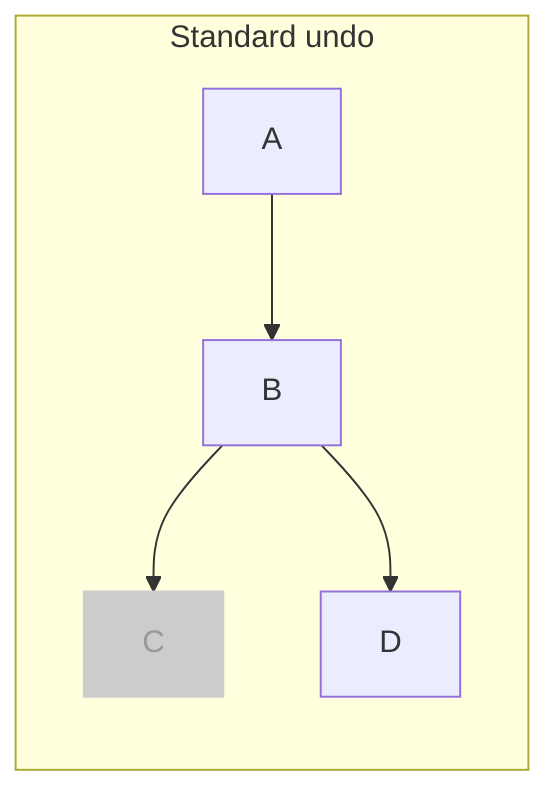
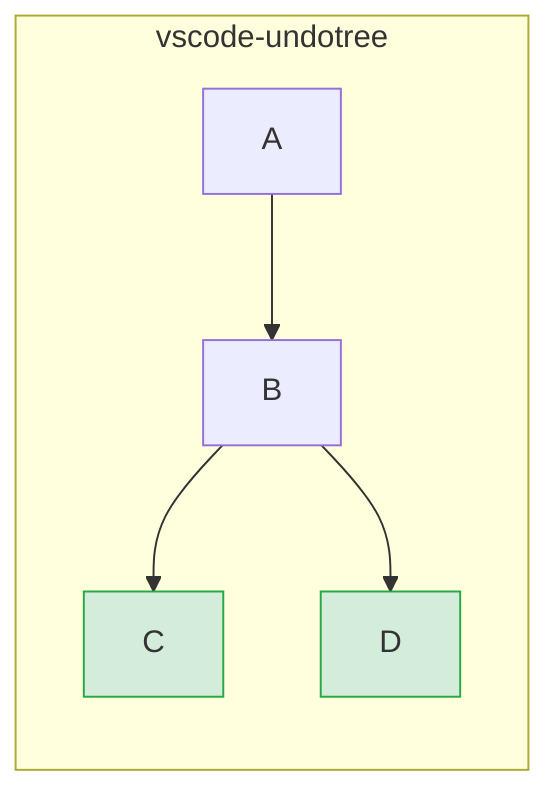
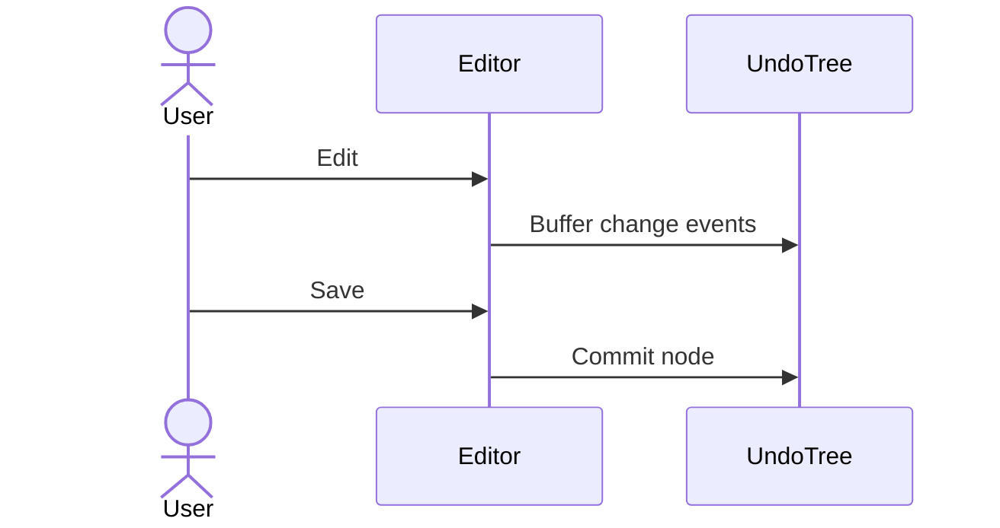
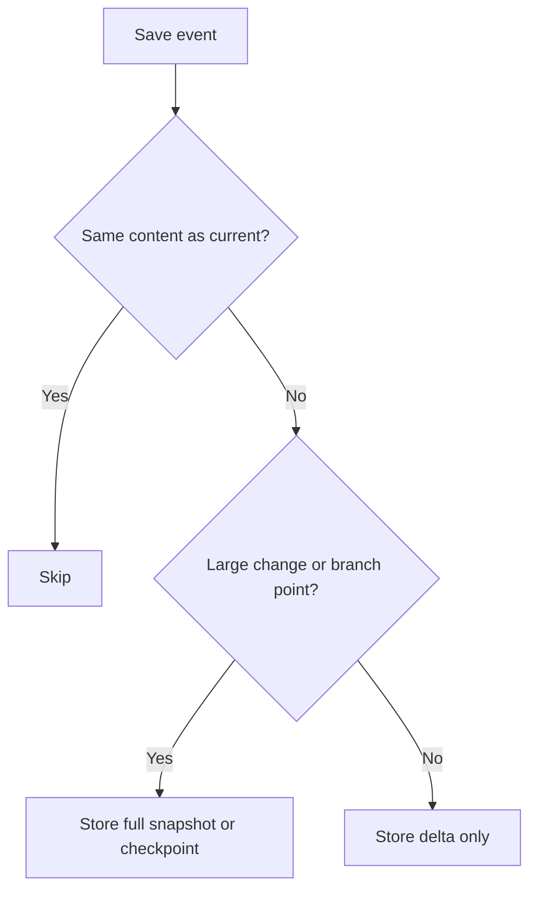

# vscode-undotree

Visualize save-based undo history as a tree in VS Code.

[Japanese README](./README_ja.md)

## Overview

Unlike standard linear undo/redo, **vscode-undotree** preserves branches. If you jump back to an older point and continue editing, the previous future remains available as another branch.

The extension records history on saves and periodic autosave checkpoints. It does not replace VS Code's native undo stack; it adds a separate history layer for navigating meaningful states.

## Features

- Tree-structured history with preserved branches
- Save-triggered checkpoints and periodic autosave checkpoints
- Sidebar navigation with keyboard support
- Diff mode for comparing a node against the current document
- Node notes and pinned nodes for important history points
- Line-count or byte-count metrics per node
- Manual and automatic persistence across sessions
- Compact / Hard Compact with preview, validation, and manual keep/remove overrides
- Diagnostics panel for persisted storage, manifest state, locks, and orphan files
- Multi-window conflict warnings in auto persistence mode
- Adaptive persistence with compression, checkpoint files, and lazy loading
- Idle resident-tree unload for persisted clean trees to reduce memory usage

## Installation

This extension is distributed as a `.vsix` file via [GitHub Releases](https://github.com/mmiyaji/vscode-undotree/releases).

1. Download the latest `.vsix` from [Releases](https://github.com/mmiyaji/vscode-undotree/releases).
2. Open VS Code.
3. Run `Extensions: Install from VSIX...` from the Command Palette.
4. Select the downloaded file.

## Usage

| Action | Method |
|--------|--------|
| Open Undo Tree panel | Explorer -> **Undo Tree** |
| Focus panel | `Ctrl+Shift+U` |
| Create checkpoint | Save the file |
| Undo / Redo | Click **Undo** / **Redo** |
| Jump to a node | Click the node row |
| Compare with current | Switch to **Diff** and select a node |
| Pause / Resume tracking | Click **Pause** / **Resume** |
| Open actions menu | Click the gear button |
| Toggle tracking for current extension | Click the status bar item |

### Panel layout

The sidebar shows a tree of save checkpoints. The highlighted row is the current position. Optional node metadata can include:

- Timestamp
- Storage kind badge (`F` / `D`)
- Line or byte delta
- Note marker
- Pin marker

### Status bar

The status bar item shows tracking state for the current file:

| Display | Meaning |
|---------|---------|
| `$(history) Undo Tree: ON` | Current extension is tracked |
| `$(circle-slash) Undo Tree: OFF` | Current extension is not tracked |
| `$(debug-pause) Undo Tree: PAUSED` | Tracking is paused globally |

### Keyboard shortcuts

When the Undo Tree panel has focus:

| Key | Action |
|-----|--------|
| `Up` / `k` | Move focus up |
| `Down` / `j` | Move focus down |
| `Left` | Move focus to parent |
| `Right` | Move focus to last child |
| `Tab` / `Shift+Tab` | Move to next / previous sibling |
| `Home` / `End` | Move to first / last node |
| `Enter` / `Space` | Jump to focused node |
| `d` | Toggle Navigate / Diff mode |
| `p` | Toggle Pause / Resume |
| `n` / `N` | Move to next / previous noted node |

### Actions menu

The menu includes:

- `Open Settings`
- `Save Persisted State`
- `Restore Persisted State`
- `Compact History`
- `Compact History Preview`
- `Hard Compact`
- `Hard Compact Preview`
- `Pause Tracking` / `Resume Tracking`
- `Toggle Tracking for This Extension`
- `Reset All State`

## Persistence

Persisted history is stored in the extension storage directory, not in the workspace by default.

Saved data is split per tracked file:

- `undo-trees/manifest.json`
- `undo-trees/manifest.json.bak`
- `undo-trees/<file-hash>.json`
- `undo-trees/content/<hash>` for large checkpoint content

Behavior:

- `Save Persisted State` writes the current tracked trees to disk
- `Restore Persisted State` reloads the saved tree for the active file
- Opening a tracked file reloads its saved tree on demand
- If the file content differs from the saved current node, a new `restore` node is appended
- Root-only untouched trees are not persisted until history actually grows
- `manifest.json.bak` is used as a fallback if the main manifest cannot be read

## Compaction

`Compact History` reduces noise in long linear chains by removing compressible middle nodes.

Current behavior:

- Simple middle nodes in a straight chain can be removed
- Branch points are kept
- Leaf nodes are kept
- The current node is kept
- Pinned nodes and noted nodes are protected
- `mixed` nodes are kept

`mixed` means a node that is not part of a pure insert-only or pure delete-only chain. Full snapshot nodes are treated as `mixed`, and delta nodes that contain both insertion and deletion are also treated as `mixed`.

### Compact preview

The preview panel shows:

- Removable nodes
- Protected nodes
- An `ALL` tree view
- Reason summaries
- Manual `Keep` / `Remove` overrides
- Validation and cleanup actions from Diagnostics when needed

## Diagnostics

Undo Tree includes a diagnostics panel for persisted storage maintenance. It is intended for development mode or when `undotree.enableDiagnostics` is enabled.

The panel can show:

- Manifest status
- Manifest backup status
- Persisted tree and content file counts
- Orphan tree/content files
- Missing or unreadable tree files
- Missing content hashes
- Multi-window lock status

Available actions include:

- `Validate Persisted Storage`
- `Prune Orphan Files`
- `Rebuild Manifest`
- `Open Storage Folder`
- `Reset All State`

## Multi-window behavior

Persistence is shared across VS Code windows because persisted history lives in the same extension storage folder.

- Different files in different windows are generally fine
- The same file in multiple windows is not recommended
- In `auto` persistence mode, Undo Tree can warn if the same tracked file appears active in another VS Code window
- The warning uses short-lived lock files with heartbeat and TTL; it is best-effort protection, not strict locking

## Configuration

Open settings from the actions menu, or search for `@ext:mmiyaji.vscode-undotree` in VS Code settings.

### General

| Setting | Default | Description |
|---------|---------|-------------|
| `undotree.enabledExtensions` | `[".txt", ".md"]` | File extensions to track |
| `undotree.excludePatterns` | `[]` | Filename patterns to exclude |
| `undotree.persistenceMode` | `"manual"` | `manual` saves only when requested; `auto` saves automatically after history changes |
| `undotree.autosaveInterval` | `30` | Autosave checkpoint interval in seconds (`0` disables it) |
| `undotree.hardCompactAfterDays` | `0` | Age threshold for `Hard Compact`; `0` disables it |
| `undotree.warnOnMultiWindowConflict` | `true` | Show warnings in `auto` mode when the same tracked file appears active in another VS Code window |

### Display

| Setting | Default | Description |
|---------|---------|-------------|
| `undotree.timeFormat` | `"time"` | `none`, `time`, `dateTime`, or `custom` |
| `undotree.timeFormatCustom` | `"yyyy-MM-dd HH:mm:ss"` | Custom timestamp format using [date-fns format](https://date-fns.org/v4.1.0/docs/format); used only when `timeFormat` is `custom` |
| `undotree.showStorageKind` | `false` | Show `F` / `D` badges |
| `undotree.nodeSizeMetric` | `"lines"` | `none`, `lines`, or `bytes` |
| `undotree.nodeSizeMetricBase` | `"current"` | Compare size against `current` or `initial` |

### Performance

These settings are mainly for advanced tuning. The defaults are recommended unless you have a clear reason to change them.

| Setting | Default | Description |
|---------|---------|-------------|
| `undotree.enableDiagnostics` | `false` | Enable the diagnostics panel outside development mode |
| `undotree.compressionThresholdKB` | `100` | Compress persisted tree files above this size |
| `undotree.checkpointThresholdKB` | `1000` | Split large persisted full snapshots into checkpoint content files above this size |
| `undotree.memoryCheckpointThresholdKB` | `32` | Prefer in-memory checkpoint promotion for large branch snapshots; recommended value: `32` |
| `undotree.contentCacheMaxKB` | `20480` | LRU cache size for checkpoint content |

## Design philosophy

### Standard undo vs. vscode-undotree

Standard undo discards the old future when you edit after undoing.

vscode-undotree preserves both branches:

### Save as the main checkpoint

Instead of recording every keystroke as a primary history unit, vscode-undotree treats file saves as meaningful checkpoints.

### Hybrid storage

### Coexisting with native undo

vscode-undotree does not replace VS Code's built-in undo stack. It adds a separate navigation layer around saved states.

## Requirements

- VS Code 1.90.0 or later

## License

MIT
