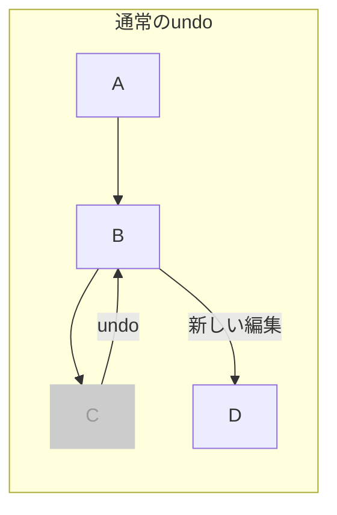
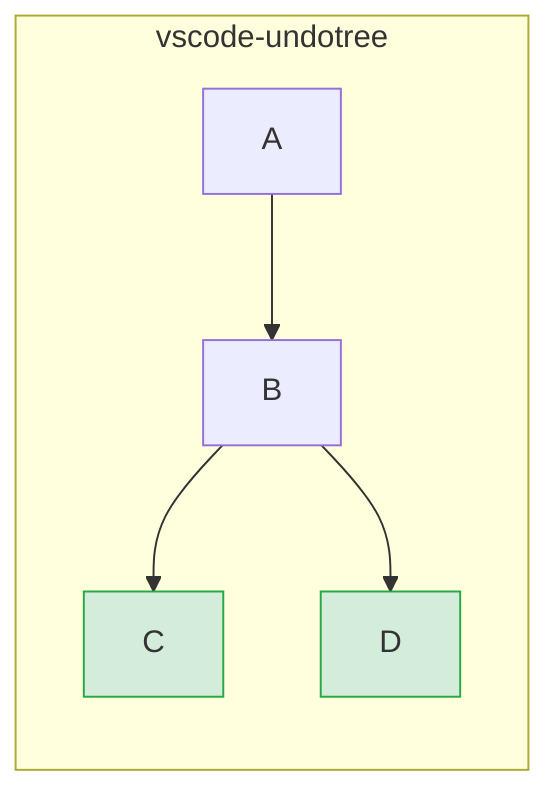
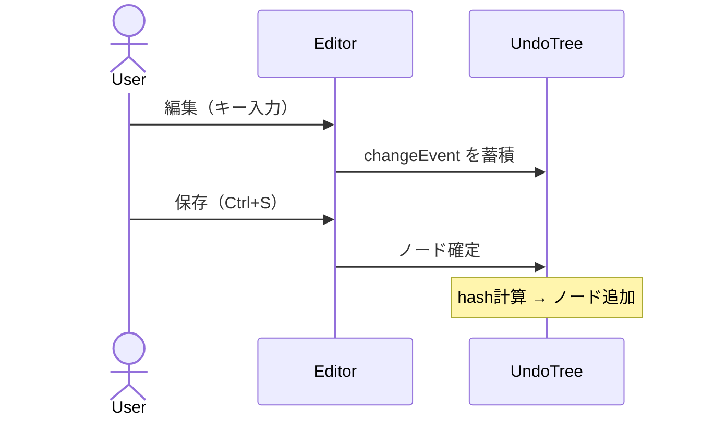
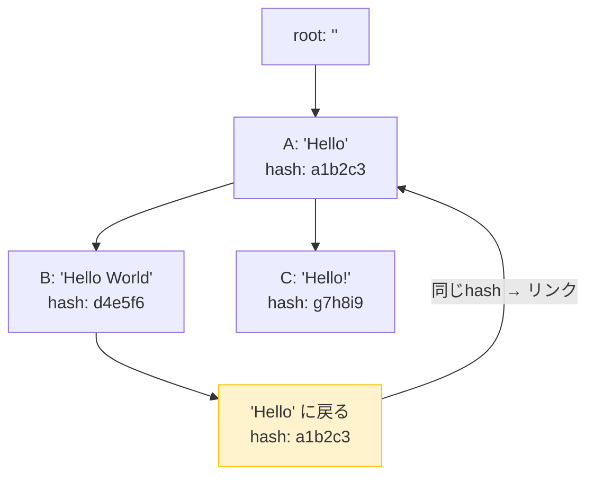
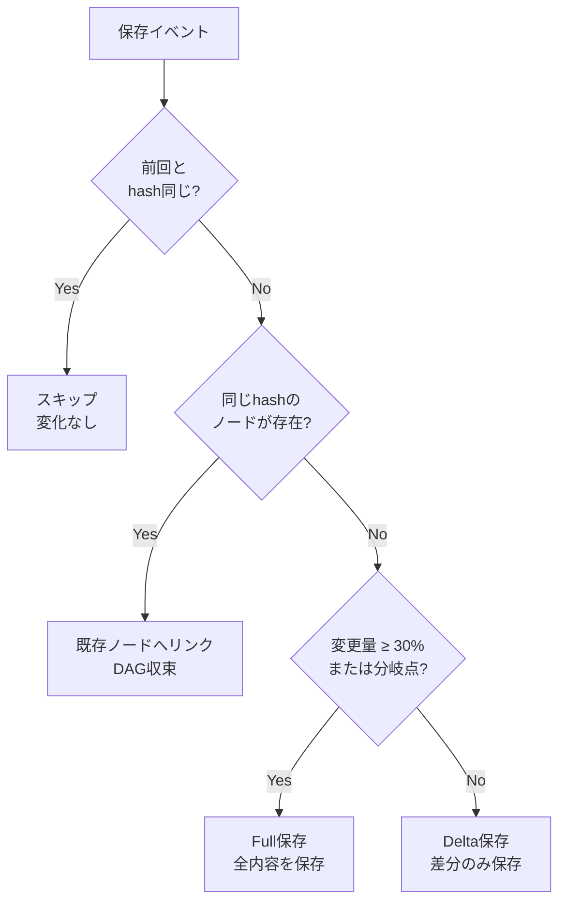
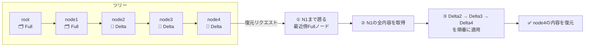

# vscode-undotree

VS Code のundo履歴をツリーとして可視化・ナビゲーションできる拡張機能です。

[English README](./README.md)

## 概要

通常の線形undo/redoとは異なり、**vscode-undotree** はすべての編集分岐を保持します。undoして新しい編集を行っても、以前の「未来」は失われません — 別のブランチとして保持され、いつでも戻ることができます。


## 機能

- **ツリー構造のundo履歴** — すべての分岐を保持し、削除されない
- **保存トリガーによるチェックポイント** — 保存（`Ctrl+S`）のたびに履歴ノードを作成。意図的な意味のあるスナップショットになる
- **定期オートセーブ** — 内容が変化していれば30秒ごとに自動的にチェックポイントを作成
- **DAG重複排除** — 以前に保存した内容に戻った場合、新しいノードを作らず既存のノードへリンク。循環検出（isAncestor）により無限ループを防止
- **ハイブリッドストレージ** — 小さな変更は差分のみ保存、大きな変更や分岐点は全量保存
- **サイドバーパネル** — エクスプローラーサイドバーで履歴ツリーを可視化。ノードをクリックして任意の時点に直接ジャンプ可能
- **選択的トラッキング** — 設定した拡張子のみ追跡（デフォルト: `.txt`, `.md`）。ステータスバーから拡張子単位で切り替え可能
- **一時停止 / 再開** — 既存ツリーを保持したまま履歴記録を一時停止

## インストール

この拡張機能は [GitHub Releases](https://github.com/mmiyaji/vscode-undotree/releases) から `.vsix` ファイルとして配布されます。

1. [Releases ページ](https://github.com/mmiyaji/vscode-undotree/releases) から最新の `.vsix` ファイルをダウンロードします。
2. VS Code を開きます。
3. コマンドパレット（`Ctrl+Shift+P`）から `Extensions: Install from VSIX...` を実行します。
4. ダウンロードした `.vsix` ファイルを選択します。

## 使い方

| 操作 | 方法 |
|------|------|
| Undo Tree パネルを開く | サイドバー → エクスプローラー → **Undo Tree** |
| パネルにフォーカス | `Ctrl+Shift+U` |
| チェックポイント作成 | ファイルを保存（`Ctrl+S`） |
| Undo / Redo | パネルの **↑ Undo** / **↓ Redo** ボタン |
| 任意ノードへジャンプ | パネルのノード行をクリック |
| 一時停止 / 再開 | パネルの **⏸ Pause** / **▶ Resume** ボタン |
| 設定を開く | パネルの **⚙** ボタン |
| 現在の拡張子を有効化/無効化 | ステータスバーのアイテムをクリック |

### パネルの見かた

```
↑ Undo  ↓ Redo  ⏸ Pause  ⚙
────────────────────────────────
● initial                 00:00:00
  ● F  save               00:01:05   ← F = 全量保存
    ● D  save             00:02:30   ← D = 差分保存
    │ ● D  auto           00:03:00
    ● D  save             00:04:12   ◀ 現在位置
```

- **二重丸 (◎)** が現在位置を示します。
- `F` = 全内容を保存、`D` = 差分のみ保存。
- 破線エッジは DAG 収束リンクを表します。

### ステータスバー

右下のステータスバーアイテムが現在のファイルの追跡状態を示します。

| 表示 | 意味 |
|------|------|
| `$(history) Undo Tree: ON` | 現在の拡張子は追跡中 |
| `$(circle-slash) Undo Tree: OFF` | 現在の拡張子は追跡対象外 — クリックで有効化 |
| `$(debug-pause) Undo Tree: PAUSED` | 追跡が一時停止中 — クリックでトグル |

ホバーすると検出された拡張子と有効リストを確認できます。

## 設定

パネルの **⚙** ボタン、または VS Code の設定画面で `undotree` を検索してください。

| 設定 | デフォルト | 説明 |
|------|-----------|------|
| `undotree.enabledExtensions` | `[".txt", ".md"]` | 自動追跡するファイル拡張子 |
| `undotree.excludePatterns` | `[]` | 除外するファイル名パターン（`*` ワイルドカード対応） |

**設定例：**

```json
// 追跡する拡張子を追加
"undotree.enabledExtensions": [".txt", ".md", ".js", ".ts"]

// ミニファイル・更新ログを除外
"undotree.excludePatterns": ["*.min.*", "CHANGELOG*"]
```

## 設計思想

### 通常のundo/redoとの違い

通常のundo/redoは線形です。undoして新しい編集をすると、以前の「未来」は永久に失われます。



vscode-undotree はすべての分岐を保持します。



### 保存を意味のあるチェックポイントとして扱う

多くのundo tree実装はキーストローク単位で履歴を記録します。これはノイズが多く、履歴のナビゲーションが困難になります。vscode-undotree は **ファイル保存を履歴の単位** として採用しました。gitのコミットと同じメンタルモデルです。



### コンテンツアドレス指定による重複排除（DAG）

各ノードはその内容のSHA-1ハッシュで識別されます。以前の保存状態に戻った場合、新しいノードを作らず既存のノードにリンクします。`isAncestor` による循環チェックでグラフが循環グラフになることを防ぎます。



### ハイブリッドストレージ：差分と全量スナップショット



### 任意ノードへの復元フロー



### VS Code ネイティブのundoと共存

vscode-undotree は VS Code 組み込みのundoスタックと並行して動作します。ネイティブのundo機構を置き換えたり割り込んだりしません。ツリーは保存チェックポイント間をナビゲートするための独立したレイヤーです。

## 動作要件

- VS Code 1.90.0 以降

## ライセンス

MIT
