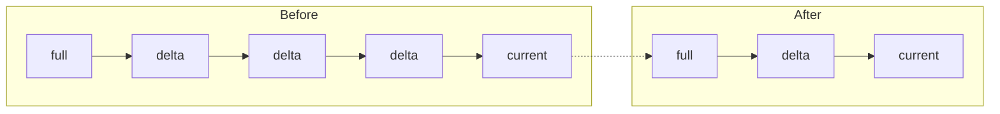
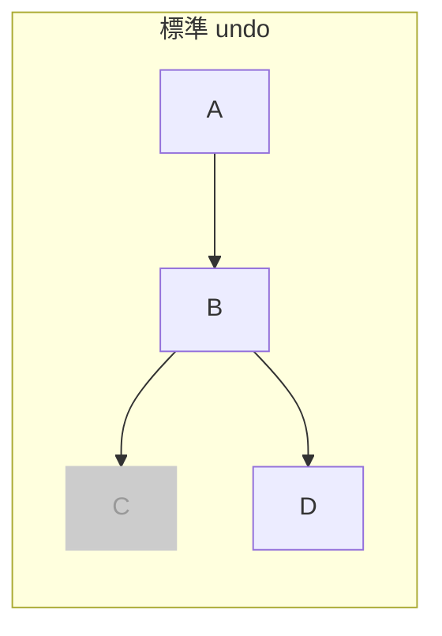
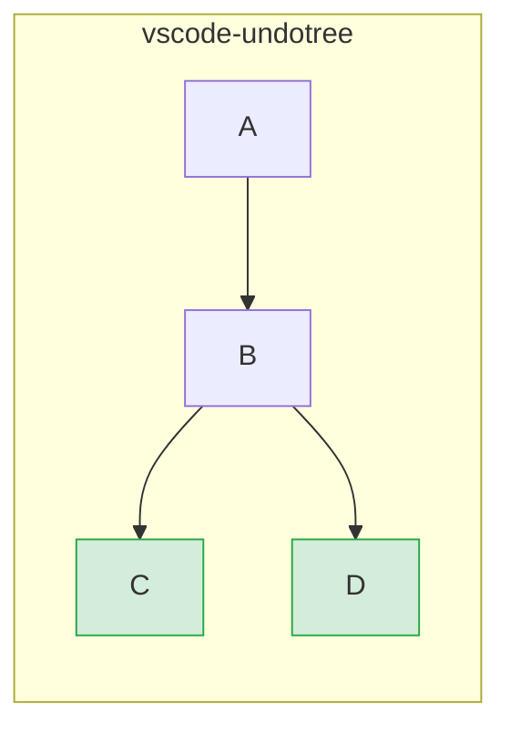
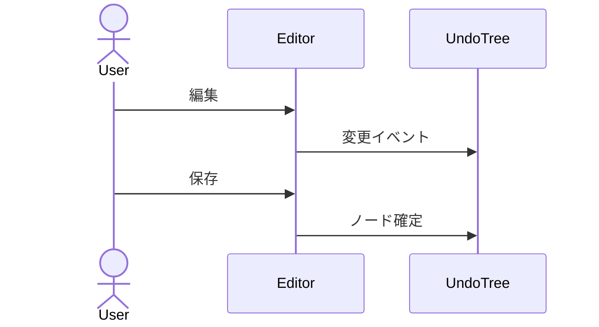
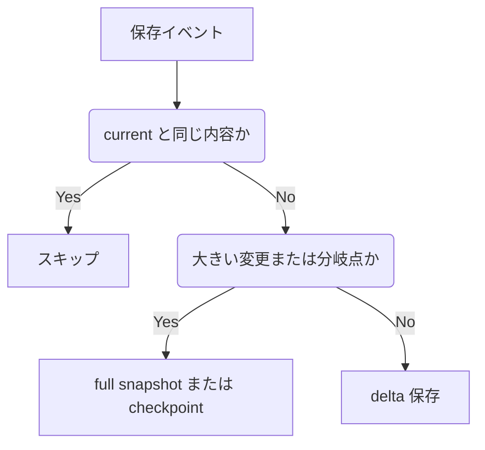

# vscode-undotree

VS Code 上で、保存ベースの Undo 履歴をツリーとして可視化する拡張です。

[English README](./README.md)

## 概要

通常の線形な undo/redo とは異なり、**vscode-undotree** は分岐した履歴を保持します。過去の地点へ戻って編集を続けても、元の未来は別ブランチとして残ります。

履歴は主にファイル保存時と、任意設定の autosave チェックポイントで記録されます。VS Code 標準の undo スタックを置き換えるものではなく、保存済み状態を辿るための独立した履歴レイヤーです。

## 主な機能

- 分岐を保持するツリー型履歴
- 保存時チェックポイントと定期 autosave チェックポイント
- サイドバーでの履歴移動とキーボード操作
- `vs Current` と `Pair Diff` の 2 つの Diff モード
- ノート、ピン、右クリックメニュー
- 行数 / バイト数メトリクスと親ノード基準の差分表示
- 相対時刻表示
- 手動 / 自動の永続化
- Compact / Hard Compact とプレビュー
- Diagnostics 画面による persisted storage の検査 / 修復
- auto 永続化時のマルチウィンドウ競合警告
- persisted 済み clean tree の idle unload による省メモリ化
- 実行時 UI の言語切替 (`auto` / `en` / `ja`)

## インストール

この拡張は [GitHub Releases](https://github.com/mmiyaji/vscode-undotree/releases) で `.vsix` として配布します。

1. [Releases](https://github.com/mmiyaji/vscode-undotree/releases) から最新の `.vsix` をダウンロードします。
2. VS Code を開きます。
3. コマンドパレットで `Extensions: Install from VSIX...` を実行します。
4. ダウンロードした `.vsix` を選択します。

## 使い方

| 操作 | 方法 |
|------|------|
| Undo Tree パネルを開く | Explorer -> **Undo Tree** |
| パネルへフォーカス | `Ctrl+Shift+U` |
| チェックポイントを作る | ファイルを保存 |
| Undo / Redo | **Undo** / **Redo** ボタン |
| ノードへ移動 | ノード行をクリック |
| 現在内容との差分を見る | **Diff** モードでノードを選択 |
| 任意ノード間 Diff | **Diff** -> **Pair Diff** -> 基準ノード選択 -> 比較先ノード選択 |
| 一時停止 / 再開 | **Pause** / **Resume** |
| アクションメニューを開く | ギアボタン |
| 対象拡張子の追跡切替 | ステータスバー項目 |

### パネル構成

サイドバーには保存ベースの履歴ツリーが表示されます。ハイライトされている行が current 位置です。設定に応じて次の情報が表示されます。

- タイムスタンプ
- ストレージ種別バッジ (`F` / `D`)
- 行数またはバイト数
- ノート
- ピン

### ステータスバー

現在ファイルの追跡状態を表示します。

| 表示 | 意味 |
|------|------|
| `$(history) Undo Tree: ON` | 現在の拡張子は追跡対象 |
| `$(circle-slash) Undo Tree: OFF` | 現在の拡張子は追跡対象外 |
| `$(debug-pause) Undo Tree: PAUSED` | 履歴記録をグローバルに一時停止中 |

### キーボード操作

Undo Tree パネルにフォーカスがあるとき:

| キー | 操作 |
|------|------|
| `Up` / `k` | 上へ移動 |
| `Down` / `j` | 下へ移動 |
| `Left` | 親へ移動 |
| `Right` | 最後の子へ移動 |
| `Tab` / `Shift+Tab` | 次 / 前の兄弟へ移動 |
| `Home` / `End` | 最初 / 最後のノードへ移動 |
| `Enter` / `Space` | 選択ノードへ移動 |
| `d` | Navigate / Diff を切替 |
| `b` | Pair Diff の基準ノードを設定 |
| `c` | `vs Current` に戻す |
| `p` | Pause / Resume を切替 |
| `n` / `N` | 次 / 前のノート付きノードへ移動 |
| `?` | ショートカット一覧オーバーレイ |

### 右クリックメニュー

ノードを右クリックすると次の操作ができます。

- `Jump`
- `Compare with Current`
- `Set Pair Diff Base`
- `Pin / Unpin`
- `Edit Note`
- `Display Settings`

### アクションメニュー

ギアメニューには次が含まれます。

- `Open Settings`
- `Save Persisted State`
- `Restore Persisted State`
- `Compact History`
- `Compact History Preview`
- `Hard Compact`
- `Hard Compact Preview`
- `Pause Tracking` / `Resume Tracking`
- `Toggle Tracking for This Extension`
- `Reset All State`

## 永続化

persisted history はワークスペース直下ではなく、拡張の storage 配下へ保存されます。

構成:

- `undo-trees/manifest.json`
- `undo-trees/manifest.json.bak`
- `undo-trees/<file-hash>.json`
- `undo-trees/content/<hash>` （大きい checkpoint content）

挙動:

- `Save Persisted State` は現在の tracked tree を保存します
- `Restore Persisted State` はアクティブファイルの保存済み tree を読み戻します
- tracked file を開くと必要時にオンデマンドで再読込します
- 実ファイル内容が saved current と異なる場合は `restore` ノードが追加されます
- root だけの未更新 tree は、履歴が伸びるまで manifest に保存しません
- `manifest.json` が読めない場合は `manifest.json.bak` をフォールバックに使います
- 壊れた persisted tree は可能な範囲で topology 修復を試み、安全に読めない場合だけ fresh tree へフォールバックします
- 永続化ファイルは一時ファイル経由で安全に書き込みます

## コンパクション

`Compact History` は長い直列チェーンの中間ノードを削って履歴を整理します。

現在のルール:

- 直列チェーン中の圧縮可能な中間ノードを削除可能
- 分岐点は保持
- 葉ノードは保持
- current ノードは保持
- pinned / noted ノードは保持
- `mixed` ノードは保持

`mixed` は、純粋な insert-only / delete-only チェーンに属さないノードです。full snapshot ノードと、挿入と削除が混在する delta ノードは `mixed` として扱います。

### Hard Compact

`Hard Compact` は age threshold を使って古い履歴をより積極的に削減します。`current` に加えて、最新タイムスタンプのノードも保護します。

### Compact Preview

プレビュー画面では次を確認できます。

- 削除候補ノード
- 保護ノード
- `ALL` ツリービュー
- 理由サマリ
- 手動 `Keep` / `Remove`
- 診断結果に応じた修復 / cleanup 導線

## Diagnostics

Undo Tree には persisted storage を保守するための Diagnostics 画面があります。開発モード、または `undotree.enableDiagnostics` を有効にした場合に使えます。

表示できる主な情報:

- manifest 状態
- backup 状態
- persisted tree / content file 数
- orphan tree / orphan content
- missing / unreadable tree file
- missing content hash
- multi-window lock 状態

主な操作:

- `Validate Persisted Storage`
- `Prune Orphan Files`
- `Rebuild Manifest`
- `Open Storage Folder`
- `Reset All State`

## マルチウィンドウ動作

persisted history は同じ extension storage を共有するため、VS Code の複数ウィンドウ間で共有されます。

- 別ファイルを別ウィンドウで使うのは概ね問題ありません
- 同じファイルを複数ウィンドウで開くのは非推奨です
- `auto` persistence 時は、別ウィンドウで同じ tracked file がアクティブに見えると警告できます
- この警告は heartbeat と TTL を使うベストエフォートな保護で、厳密な排他制御ではありません

## リネーム / 移動

`onDidRenameFiles` を使って、表示中ファイルの rename / move 後も履歴を引き継ぎます。

- in-memory tree を旧 URI から新 URI に移動
- persisted manifest と tree file 名も新 URI 側に更新
- rename 中は close/unload を抑止して履歴消失を防止

## 設定

アクションメニューの `Open Settings` から開くか、VS Code 設定で `@ext:mmiyaji.vscode-undotree` を検索してください。

### General

| 設定 | 既定値 | 説明 |
|------|--------|------|
| `undotree.enabledExtensions` | `[".txt", ".md"]` | 追跡する拡張子 |
| `undotree.excludePatterns` | `[]` | 除外するファイル名パターン |
| `undotree.persistenceMode` | `"manual"` | `manual` は明示保存のみ、`auto` は履歴更新後に自動保存 |
| `undotree.autosaveInterval` | `30` | autosave チェックポイント間隔（秒）。`0` で無効 |
| `undotree.hardCompactAfterDays` | `0` | `Hard Compact` の日数閾値。`0` で無効 |
| `undotree.warnOnMultiWindowConflict` | `true` | `auto` モードで同一 tracked file の別ウィンドウ競合を警告 |
| `undotree.language` | `"auto"` | 実行時 UI 言語。`auto` / `en` / `ja` |

### Display

| 設定 | 既定値 | 説明 |
|------|--------|------|
| `undotree.timeFormat` | `"time"` | `none` / `time` / `dateTime` / `relative` / `custom` |
| `undotree.timeFormatCustom` | `"yyyy-MM-dd HH:mm:ss"` | [date-fns format](https://date-fns.org/v4.1.0/docs/format) 準拠。`timeFormat=custom` のときのみ使用 |
| `undotree.showStorageKind` | `false` | `F` / `D` バッジを表示 |
| `undotree.nodeSizeMetric` | `"lines"` | `none` / `lines` / `bytes` |
| `undotree.nodeSizeMetricBase` | `"parent"` | サイズ比較基準。`current` / `initial` / `parent` |

### Performance

これらは主に高度な調整用です。理由がなければ既定値を推奨します。

| 設定 | 既定値 | 説明 |
|------|--------|------|
| `undotree.enableDiagnostics` | `false` | 開発モード外でも Diagnostics 画面を有効化 |
| `undotree.compressionThresholdKB` | `100` | これを超える persisted tree file を圧縮 |
| `undotree.checkpointThresholdKB` | `1000` | これを超える大きい full snapshot を checkpoint content に分離 |
| `undotree.memoryCheckpointThresholdKB` | `32` | 大きい branch snapshot を in-memory checkpoint へ寄せる閾値。推奨値: `32` |
| `undotree.contentCacheMaxKB` | `20480` | checkpoint content の LRU cache 上限 |

## 設計思想

### 標準 undo との違い

標準 undo は、undo 後に編集すると元の未来を捨てます。

vscode-undotree は両方の分岐を保持します。

### 保存を主なチェックポイントにする

すべてのキー入力を主履歴単位にするのではなく、保存を意味のあるチェックポイントとして扱います。

### ハイブリッド保存形式

### ネイティブ undo との共存

vscode-undotree は VS Code 標準の undo stack を置き換えません。保存済み状態を辿るための追加ナビゲーション層として共存します。

## 動作要件

- VS Code 1.90.0 以上

## ライセンス

MIT
