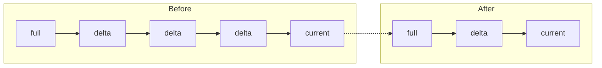
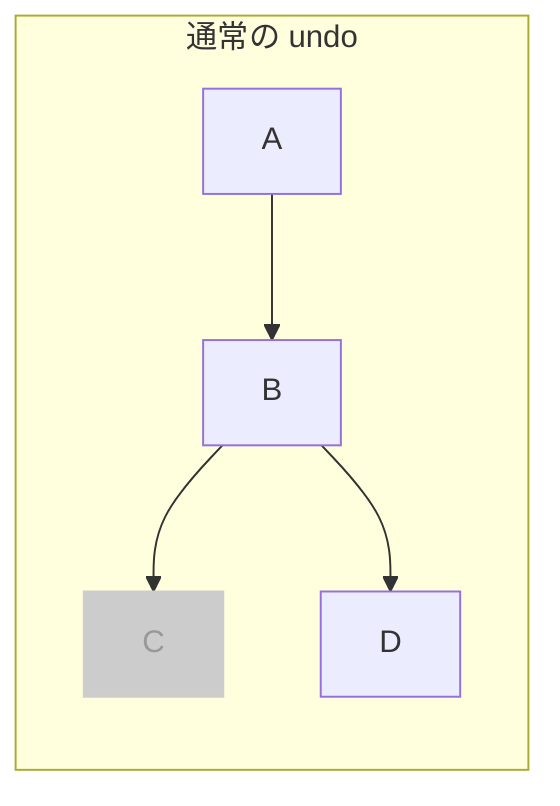
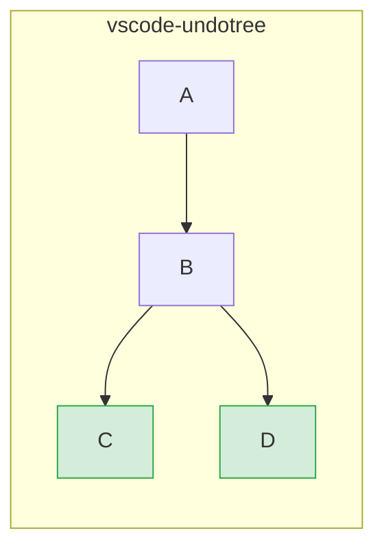
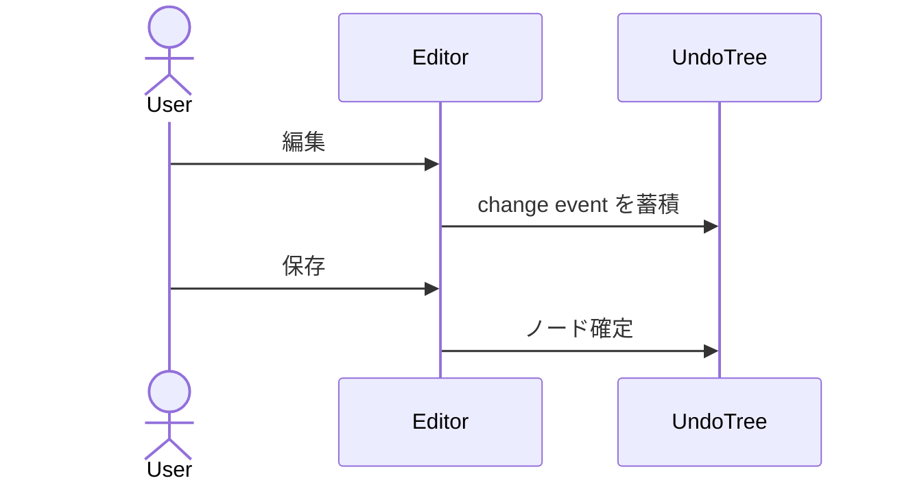
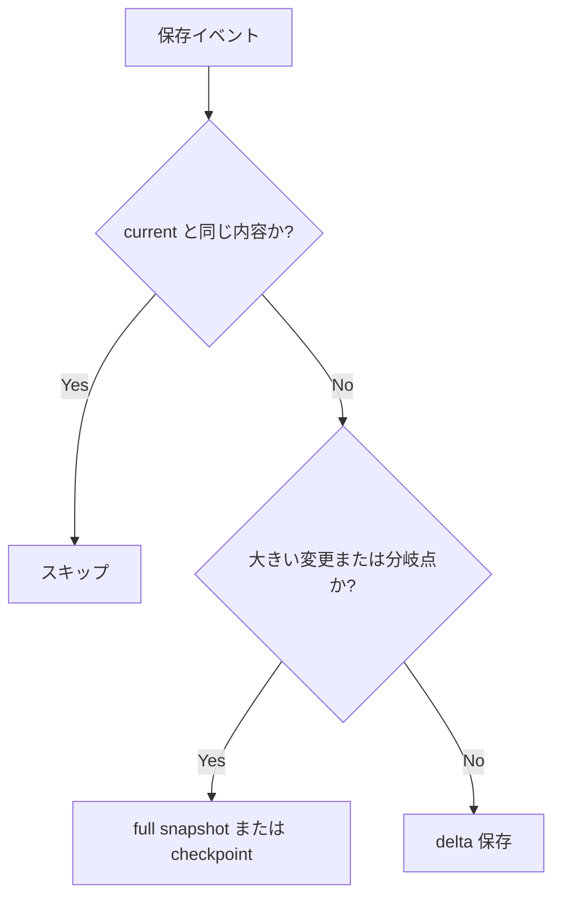

# vscode-undotree

VS Code 上で、保存ベースの undo 履歴をツリーとして可視化する拡張です。

[English README](./README.md)

## 概要

通常の線形な undo/redo と違い、**vscode-undotree** は分岐した履歴を保持します。過去の地点へ戻って編集を続けても、元の未来は別ブランチとして残ります。

履歴は主にファイル保存と定期 autosave をもとに記録されます。VS Code 標準の undo スタックを置き換えるのではなく、意味のある保存時点をたどるための別レイヤーとして動作します。

## 主な機能

- 分岐を保持するツリー型履歴
- 保存時チェックポイントと定期 autosave チェックポイント
- サイドバーでの履歴移動とキーボード操作
- 任意ノードと現在内容を比較する Diff モード
- ノートとピンによる重要ノード管理
- 行数差分 / バイト差分の表示
- 手動保存 / 自動保存による永続化
- Compact / Hard Compact とそのプレビュー
- manifest、orphan file、lock を確認できる診断画面
- auto 永続化時のマルチウィンドウ競合警告
- 圧縮、チェックポイント分離、遅延読込による永続化最適化
- persisted 済みで clean な tree のアイドル時メモリアンロード

## インストール

この拡張は [GitHub Releases](https://github.com/mmiyaji/vscode-undotree/releases) から `.vsix` として配布します。

1. [Releases](https://github.com/mmiyaji/vscode-undotree/releases) から最新の `.vsix` をダウンロードします。
2. VS Code を開きます。
3. コマンドパレットで `Extensions: Install from VSIX...` を実行します。
4. ダウンロードした `.vsix` を選択します。

## 使い方

| 操作 | 方法 |
|------|------|
| Undo Tree を開く | Explorer -> **Undo Tree** |
| パネルにフォーカス | `Ctrl+Shift+U` |
| チェックポイント作成 | ファイル保存 |
| Undo / Redo | **Undo** / **Redo** ボタン |
| ノードへ移動 | 行をクリック |
| 現在内容と比較 | **Diff** にしてノードを選択 |
| 追跡の一時停止 / 再開 | **Pause** / **Resume** |
| アクションメニューを開く | ギアボタン |
| 現在拡張子の追跡切替 | ステータスバー項目 |

### パネル

サイドバーには保存履歴のツリーが表示されます。ハイライト行が現在位置です。設定に応じて次の情報を表示できます。

- 時刻
- 保存形式バッジ (`F` / `D`)
- 行数差分またはバイト差分
- ノート
- ピン

### ステータスバー

右下のステータスバーには現在ファイルの追跡状態が表示されます。

| 表示 | 意味 |
|------|------|
| `$(history) Undo Tree: ON` | 現在の拡張子は追跡対象 |
| `$(circle-slash) Undo Tree: OFF` | 現在の拡張子は追跡対象外 |
| `$(debug-pause) Undo Tree: PAUSED` | 履歴記録が全体で一時停止中 |

### キーボード操作

Undo Tree パネルにフォーカスがあるとき:

| キー | 操作 |
|------|------|
| `Up` / `k` | 上へ移動 |
| `Down` / `j` | 下へ移動 |
| `Left` | 親へ移動 |
| `Right` | 最後の子へ移動 |
| `Tab` / `Shift+Tab` | 次 / 前の兄弟へ移動 |
| `Home` / `End` | 最初 / 最後のノードへ移動 |
| `Enter` / `Space` | 選択ノードへ移動 |
| `d` | Navigate / Diff 切替 |
| `p` | Pause / Resume 切替 |
| `n` / `N` | 次 / 前のノート付きノードへ移動 |

### アクションメニュー

メニューには次の項目があります。

- `Open Settings`
- `Save Persisted State`
- `Restore Persisted State`
- `Compact History`
- `Compact History Preview`
- `Hard Compact`
- `Hard Compact Preview`
- `Pause Tracking` / `Resume Tracking`
- `Toggle Tracking for This Extension`
- `Reset All State`

## 永続化

永続化データは通常、ワークスペースではなく拡張ストレージに保存されます。

保存構成:

- `undo-trees/manifest.json`
- `undo-trees/manifest.json.bak`
- `undo-trees/<file-hash>.json`
- `undo-trees/content/<hash>` （大きい checkpoint content）

挙動:

- `Save Persisted State` で現在の tracked tree を保存
- `Restore Persisted State` でアクティブファイルの保存済み tree を復元
- tracked file を開くと必要時にオンデマンドで復元
- ディスク内容と saved current が違う場合は `restore` ノードを追加
- 履歴が root のみのファイルは、履歴が実際に伸びるまで manifest に保存しない
- `manifest.json` が壊れている場合は `manifest.json.bak` をフォールバックとして使用

## コンパクション

`Compact History` は、長い直列チェーンの中で圧縮可能な中間ノードを削除して履歴を見やすくします。

現在の仕様:

- 直列チェーン中の単純な中間ノードを削除可能
- 分岐点は保持
- 葉ノードは保持
- current ノードは保持
- ピン留めノードとノート付きノードは保護
- `mixed` ノードは保持

`mixed` は、純粋な insert-only / delete-only のチェーンに属さないノードです。full snapshot ノードと、挿入と削除を両方含む delta ノードは `mixed` として扱われます。

### コンパクションプレビュー

プレビュー画面では次を確認できます。

- 削除候補ノード
- 保護ノード
- `ALL` ツリー表示
- 理由サマリ
- 手動 `Keep` / `Remove` 指定
- 必要に応じた検証・掃除アクション

## 診断画面

Undo Tree には永続化ストレージ用の診断画面があります。開発モード、または `undotree.enableDiagnostics` を有効にしたときに利用できます。

確認できる内容:

- manifest 状態
- manifest backup 状態
- persisted tree / content file 数
- orphan tree / orphan content
- missing / unreadable tree file
- missing content hash
- multi-window lock 状態

主な操作:

- `Validate Persisted Storage`
- `Prune Orphan Files`
- `Rebuild Manifest`
- `Open Storage Folder`
- `Reset All State`

## マルチウィンドウ動作

永続化先は拡張ストレージで共有されるため、複数の VS Code ウィンドウ間で persisted history を共有します。

- 別ファイルを別ウィンドウで扱う分には基本的に問題ありません
- 同じファイルを複数ウィンドウで扱うのは非推奨です
- `auto` 永続化時は、同じ tracked file が別ウィンドウでアクティブに見えると警告できます
- この警告は heartbeat と TTL を使うベストエフォートな lock です。厳密な排他制御ではありません

## 設定

アクションメニューから設定を開くか、VS Code 設定で `@ext:mmiyaji.vscode-undotree` を検索してください。

### General

| 設定 | 既定値 | 説明 |
|------|--------|------|
| `undotree.enabledExtensions` | `[".txt", ".md"]` | 追跡する拡張子 |
| `undotree.excludePatterns` | `[]` | 除外するファイル名パターン |
| `undotree.persistenceMode` | `"manual"` | `manual` は明示保存のみ、`auto` は履歴更新後に自動保存 |
| `undotree.autosaveInterval` | `30` | autosave チェックポイントの間隔（秒） |
| `undotree.hardCompactAfterDays` | `0` | `Hard Compact` の日数閾値。`0` で無効 |
| `undotree.warnOnMultiWindowConflict` | `true` | `auto` 時に同一 tracked file の多窓競合候補を警告 |

### Display

| 設定 | 既定値 | 説明 |
|------|--------|------|
| `undotree.timeFormat` | `"time"` | `none` / `time` / `dateTime` / `custom` |
| `undotree.timeFormatCustom` | `"yyyy-MM-dd HH:mm:ss"` | [date-fns format](https://date-fns.org/v4.1.0/docs/format) 準拠。`timeFormat=custom` 時のみ使用 |
| `undotree.showStorageKind` | `false` | `F` / `D` バッジを表示 |
| `undotree.nodeSizeMetric` | `"lines"` | `none` / `lines` / `bytes` |
| `undotree.nodeSizeMetricBase` | `"current"` | 差分比較基準を `current` / `initial` から選択 |

### Performance

この分類は主に高度な調整用です。明確な理由がない限り既定値を推奨します。

| 設定 | 既定値 | 説明 |
|------|--------|------|
| `undotree.enableDiagnostics` | `false` | 開発モード以外でも診断画面を有効化 |
| `undotree.compressionThresholdKB` | `100` | これを超える persisted tree file を圧縮 |
| `undotree.checkpointThresholdKB` | `1000` | 大きい full snapshot を checkpoint content に分離 |
| `undotree.memoryCheckpointThresholdKB` | `32` | 大きい分岐 snapshot をメモリ内 checkpoint へ昇格する閾値。推奨値: `32` |
| `undotree.contentCacheMaxKB` | `20480` | checkpoint content の LRU キャッシュ上限 |

## 設計方針

### 通常の undo との違い

通常の undo は、undo 後に新しく編集すると元の未来を失います。

vscode-undotree は両方の分岐を保持します。

### 保存を主要なチェックポイントにする

vscode-undotree は、すべてのキー入力ではなく「保存」を主な履歴単位として扱います。

### ハイブリッド保存形式

### ネイティブ undo とは独立

vscode-undotree は VS Code 標準の undo スタックを置き換えません。保存時点を移動するための別のナビゲーション層として動作します。

## 要件

- VS Code 1.90.0 以上

## ライセンス

MIT
