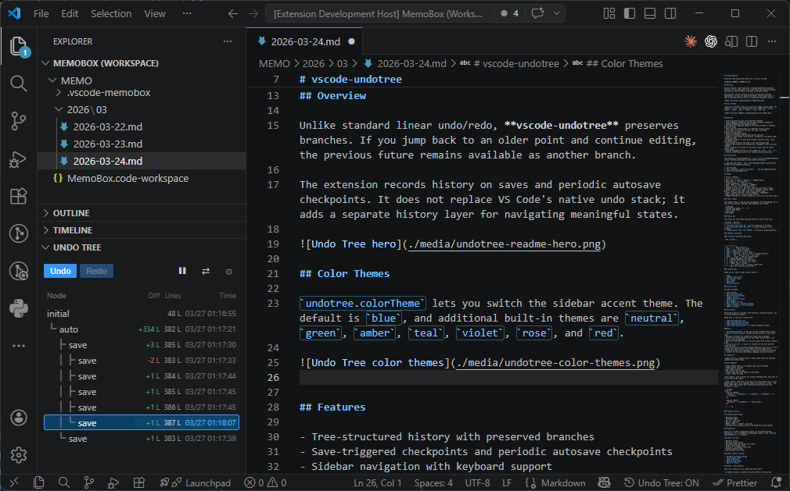
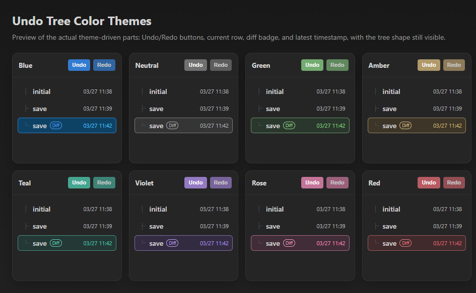
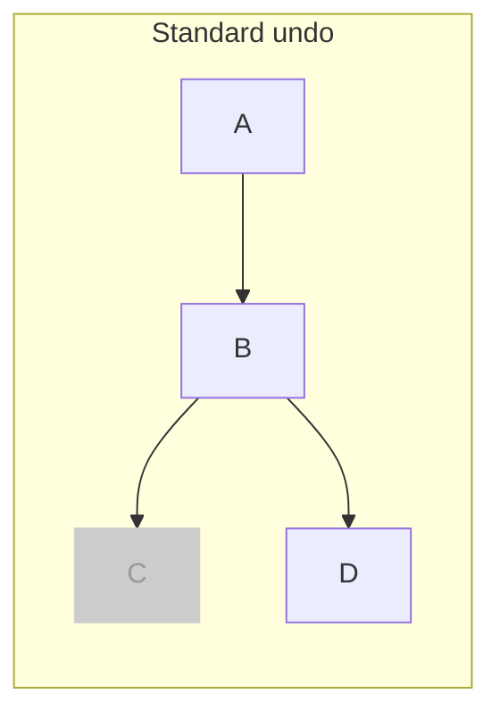
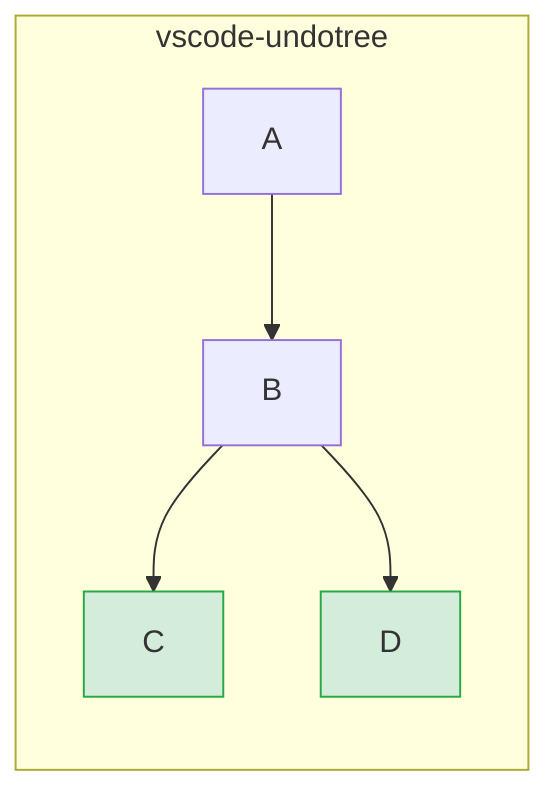
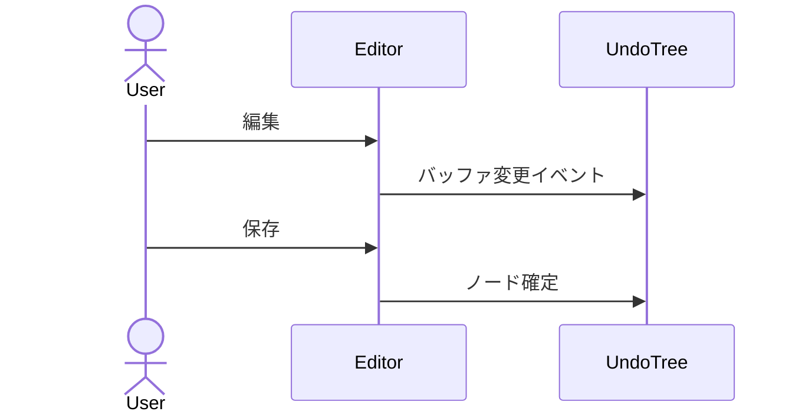
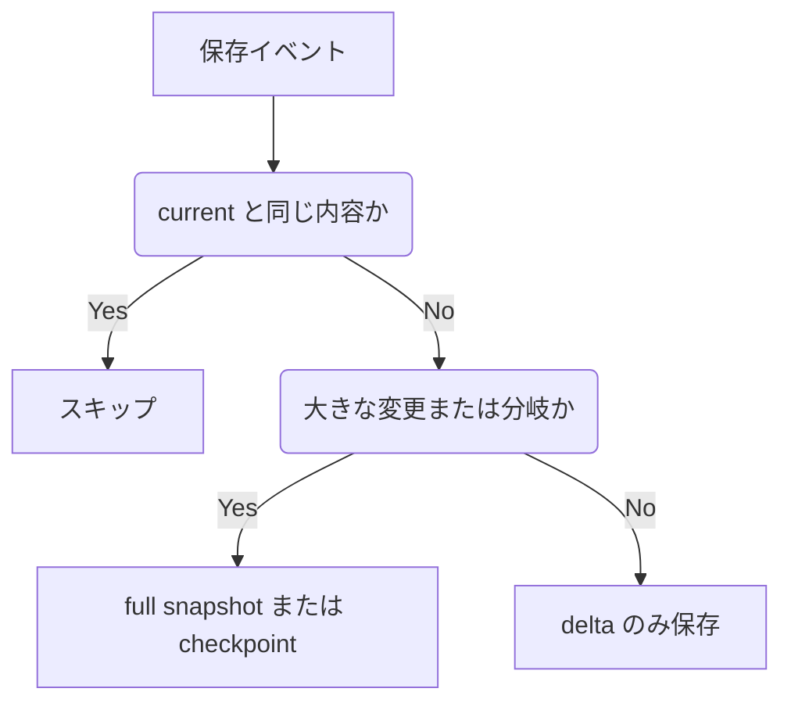

# vscode-undotree

VS Code 上で、保存を基準にした Undo 履歴をツリーとして可視化する拡張です。

[English README](./README.md)

## 概要

通常の直線的な undo/redo とは異なり、**vscode-undotree** は分岐を保持します。過去の位置に戻って編集を続けても、それまでの未来は別の枝として残ります。

履歴は主にファイル保存時と定期 autosave チェックポイントで記録されます。VS Code 標準の undo スタックを置き換えるのではなく、意味のある保存状態をたどるための別レイヤーとして動作します。

## カラーテーマ

`undotree.colorTheme` でサイドバーのアクセントカラーを切り替えられます。既定値は `blue` で、`auto` は VS Code の現在のテーマに合わせて自動調整します。ライト系テーマでは文字コントラストも強めます。そのほかに `neutral`、`green`、`amber`、`teal`、`violet`、`rose`、`red` も選べます。

## 主な機能

- 分岐を保持するツリー型履歴
- 保存時チェックポイントと定期 autosave チェックポイント
- サイドバー上での履歴移動とキーボード操作
- 現在内容との差分比較、任意ノード間の Pair Diff
- ノードメモとピン留め
- 行数またはバイト数の差分表示。親ノード基準の差分表示にも対応
- 相対時刻表示
- 手動 / 自動の永続化
- Compact / Hard Compact と、そのプレビュー、検証、手動 Keep/Remove
- persisted storage、manifest、lock、孤立ファイルを確認できる Diagnostics 画面
- `auto` 永続化時のマルチウィンドウ競合警告
- 圧縮、checkpoint、lazy load を使った永続化最適化
- persisted 済みで clean な tree の idle unload による省メモリ化
- サイドバー UI の実行時言語切替 (`auto` / `en` / `ja`)
- ファイル rename / move 後の履歴引き継ぎ

## インストール

この拡張は `.vsix` 形式で [GitHub Releases](https://github.com/mmiyaji/vscode-undotree/releases) から配布しています。

1. [Releases](https://github.com/mmiyaji/vscode-undotree/releases) から最新の `.vsix` をダウンロードします。
2. VS Code を開きます。
3. コマンドパレットから `Extensions: Install from VSIX...` を実行します。
4. ダウンロードした `.vsix` を選択します。

## 使い方

| 操作 | 方法 |
|------|------|
| Undo Tree パネルを開く | Explorer -> **Undo Tree** |
| パネルへフォーカス | `Ctrl+Shift+U` |
| チェックポイント作成 | ファイルを保存 |
| Undo / Redo | **Undo** / **Redo** ボタン |
| ノードへ移動 | ノード行をクリック |
| 現在内容との差分を見る | **Diff** モードでノードを選択 |
| ノード間比較 | **Diff** -> **Pair Diff** -> 基準ノード選択 -> 比較先ノード選択 |
| 一時停止 / 再開 | **Pause** / **Resume** |
| アクションメニューを開く | ギアボタン |
| 現在ファイル拡張子の追跡 ON/OFF | ステータスバー項目 |

### パネル表示

サイドバーには保存履歴のツリーが表示されます。ハイライトされた行が現在位置です。必要に応じて次の情報を表示できます。

- タイムスタンプ
- ストレージ種別バッジ (`F` / `D`)
- 行数またはバイト数の差分
- メモ
- ピン留め

### ステータスバー

ステータスバー項目は、現在ファイルの追跡状態を表示します。

| 表示 | 意味 |
|------|------|
| `$(history) Undo Tree: ON` | 現在の拡張子は追跡対象 |
| `$(circle-slash) Undo Tree: OFF` | 現在の拡張子は追跡対象外 |
| `$(debug-pause) Undo Tree: PAUSED` | 履歴記録をグローバルに一時停止中 |

### キーボード操作

Undo Tree パネルにフォーカスがあるとき:

| キー | 操作 |
|------|------|
| `Up` / `k` | 上へ移動 |
| `Down` / `j` | 下へ移動 |
| `Left` | 親へ移動 |
| `Right` | 最後の子へ移動 |
| `Tab` / `Shift+Tab` | 次 / 前の sibling へ移動 |
| `Home` / `End` | 最初 / 最後のノードへ移動 |
| `Enter` / `Space` | フォーカス中のノードへジャンプ |
| `d` | Navigate / Diff モード切替 |
| `b` | Pair Diff の基準ノード設定 |
| `c` | `vs Current` に戻る |
| `p` | Pause / Resume |
| `n` / `N` | 次 / 前のメモ付きノードへ移動 |
| `?` | ショートカット一覧オーバーレイ表示 |

### 右クリックメニュー

ノードを右クリックすると、次の操作を選べます。

- `Jump`
- `Compare with Current`
- `Set Pair Diff Base`
- `Pin / Unpin`
- `Edit Note`
- `Display Settings`

### アクションメニュー

アクションメニューには次があります。

- `Open Settings`
- `Save Persisted State`
- `Restore Persisted State`
- `Compact History`
- `Compact History Preview`
- `Hard Compact`
- `Hard Compact Preview`
- `Pause Tracking` / `Resume Tracking`
- `Toggle Tracking for This Extension`
- `Reset All State`

## 永続化

永続化された履歴はワークスペースではなく、拡張の storage ディレクトリへ保存されます。

保存データは tracked file ごとに分かれます。

- `undo-trees/manifest.json`
- `undo-trees/manifest.json.bak`
- `undo-trees/<file-hash>.json`
- `undo-trees/content/<hash>`（大きい checkpoint content）

挙動:

- `Save Persisted State` は現在の tracked tree をディスクへ保存します
- `Restore Persisted State` はアクティブファイルの保存済み tree を読み戻します
- tracked file を開くと、保存済み tree をオンデマンドで読み込みます
- ファイル内容が保存済み current node と異なる場合は、新しい `restore` ノードを追加します
- root だけで履歴がまだ伸びていない tree は保存しません
- `manifest.json` が読めないときは `manifest.json.bak` を使います
- interrupted write で 0 バイトの履歴ファイルが残らないよう、一時ファイル経由で保存します
- 壊れた persisted tree topology は、可能な範囲で修復してから読み込みます

## コンパクション

`Compact History` は、長い直列チェーンのノイズを減らすために圧縮可能な中間ノードを削減します。

現在のルール:

- 直列チェーン中の単純な中間ノードは削除候補
- 分岐点は保持
- leaf ノードは保持
- current ノードは保持
- pinned ノードと noted ノードは保護
- `mixed` ノードは保持

`Hard Compact` は `current` に加えて、最新タイムスタンプのノードも保護します。

### Compact Preview

プレビュー画面では次を確認できます。

- 削除候補ノード
- 保護ノード
- `ALL` ツリー表示
- 理由サマリ
- 手動 `Keep` / `Remove`
- 必要に応じた validation / cleanup 操作

## Diagnostics

Undo Tree には persisted storage 用の Diagnostics 画面があります。開発モードか `undotree.enableDiagnostics` を有効にした場合に使えます。

表示内容:

- manifest 状態
- manifest backup 状態
- persisted tree / content file 数
- orphan tree / orphan content
- missing / unreadable tree file
- missing content hash
- multi-window lock 状態

主な操作:

- `Validate Persisted Storage`
- `Prune Orphan Files`
- `Rebuild Manifest`
- `Open Storage Folder`
- `Reset All State`

## rename / move 後の挙動

Undo Tree はファイルの rename / move を監視します。

- in-memory tree を旧 URI から新 URI へ移動
- persisted manifest と tree file 名も新 URI に更新
- rename 中は close/unload を一時停止し、履歴を失わないようにする

## マルチウィンドウ挙動

persisted history は同じ extension storage フォルダを使うため、VS Code の複数ウィンドウ間で共有されます。

- 別ファイルを別ウィンドウで使うのは概ね問題ありません
- 同じファイルを複数ウィンドウで使うのは非推奨です
- `auto` 永続化時は、同じ tracked file が別ウィンドウで active になっていると警告できます
- この警告は heartbeat と TTL を使う best-effort lock で、厳密な排他制御ではありません

## 設定

アクションメニューの `Open Settings` から開くか、VS Code 設定で `@ext:mmiyaji.vscode-undotree` を検索してください。

### General

| 設定 | 既定値 | 説明 |
|------|--------|------|
| `undotree.enabledExtensions` | `[".txt", ".md"]` | 追跡対象の拡張子 |
| `undotree.excludePatterns` | `[]` | 除外するファイル名パターン |
| `undotree.persistenceMode` | `"manual"` | `manual` は明示保存のみ、`auto` は履歴更新後に自動保存 |
| `undotree.autosaveInterval` | `30` | autosave チェックポイント間隔（秒）。`0` で無効 |
| `undotree.hardCompactAfterDays` | `0` | `Hard Compact` の日数閾値。`0` で無効 |
| `undotree.warnOnMultiWindowConflict` | `true` | `auto` モードで、同じ tracked file が別ウィンドウで active のとき警告 |
| `undotree.language` | `"auto"` | 実行時 UI 言語。`auto` / `en` / `ja` |

### Display

| 設定 | 既定値 | 説明 |
|------|--------|------|
| `undotree.timeFormat` | `"time"` | `none` / `time` / `dateTime` / `relative` / `custom` |
| `undotree.timeFormatCustom` | `"yyyy-MM-dd HH:mm:ss"` | [date-fns format](https://date-fns.org/v4.1.0/docs/format) 互換。`timeFormat = custom` のときのみ使用 |
| `undotree.showStorageKind` | `false` | `F` / `D` バッジ表示 |
| `undotree.nodeSizeMetric` | `"lines"` | `none` / `lines` / `bytes` |
| `undotree.nodeSizeMetricBase` | `"parent"` | サイズ差分の基準。`current` / `initial` / `parent` |
| `undotree.colorTheme` | `"blue"` | サイドバーのアクセントテーマ。`blue` / `auto` / `neutral` / `green` / `amber` / `teal` / `violet` / `rose` / `red` |

### Performance

これらは主に高度な調整用です。特別な理由がない限り既定値を推奨します。

| 設定 | 既定値 | 説明 |
|------|--------|------|
| `undotree.enableDiagnostics` | `false` | 開発モード外でも Diagnostics 画面を有効化 |
| `undotree.compressionThresholdKB` | `100` | これを超える persisted tree file を圧縮 |
| `undotree.checkpointThresholdKB` | `1000` | 大きい full snapshot を checkpoint content file へ分離する閾値 |
| `undotree.memoryCheckpointThresholdKB` | `32` | 大きい branch snapshot の in-memory checkpoint 化閾値。推奨値は `32` |
| `undotree.contentCacheMaxKB` | `20480` | checkpoint content の LRU cache サイズ |

## 設計補足

### 通常 undo との違い

通常の undo は分岐を保持しませんが、vscode-undotree は分岐を残します。

### 保存を主チェックポイントとする理由

すべてのキー入力を主履歴にするとノイズが増えるため、Undo Tree は保存を意味のあるチェックポイントとして扱います。

### ハイブリッド保存形式

### native undo との共存

vscode-undotree は VS Code 標準の undo stack を置き換えません。保存単位の履歴を中長期でたどるための補助ナビゲーションレイヤーとして共存します。

## 要件

- VS Code 1.90.0 以上

## ライセンス

MIT
