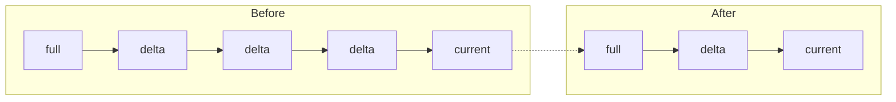
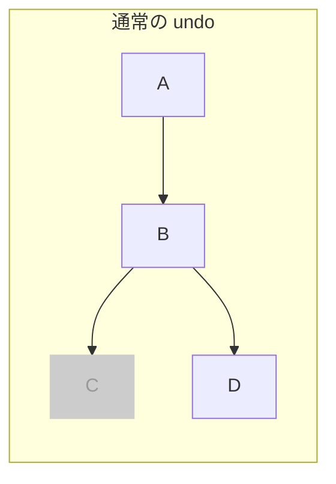
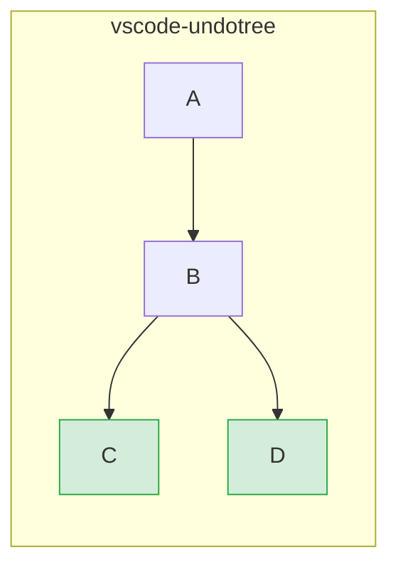
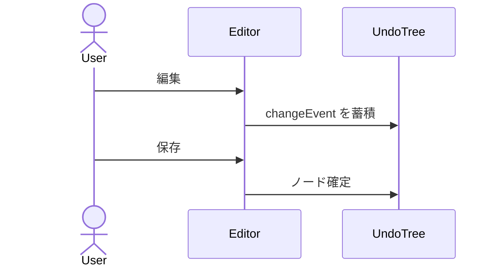
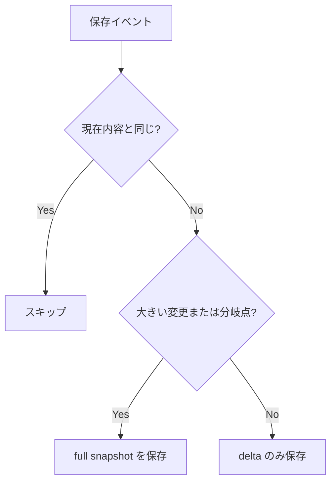
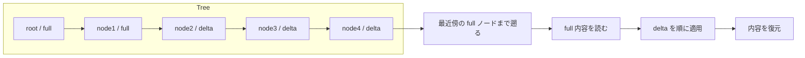

# vscode-undotree

VS Code の保存ベース undo 履歴をツリーとして可視化し、移動できる拡張です。

[English README](./README.md)

## 概要

通常の線形 undo/redo とは異なり、**vscode-undotree** は編集分岐を保持します。過去ノードに戻って別の編集を始めても、元の未来は失われず、別ブランチとして残ります。

履歴はファイル保存と定期 autosave を単位に作られます。VS Code 標準の undo を置き換えるものではなく、意味のある状態をたどるための別レイヤーです。


## 機能

- **ツリー構造の undo 履歴**: 分岐を捨てずに保持
- **保存トリガーのチェックポイント**: 保存ごとに履歴ノードを追加
- **定期 autosave**: 内容が変わっていれば 30 秒ごとにチェックポイントを追加
- **ハイブリッドストレージ**: 小さい変更は diff、大きい変更や分岐点は full snapshot
- **サイドバーパネル**: 履歴ツリーを表示し、クリックで任意ノードへ移動
- **Diff モード**: 任意ノードと現在内容を比較
- **選択的トラッキング**: 拡張子単位の追跡と除外パターンに対応
- **Pause / Resume**: 既存ツリーを保持したまま履歴記録を一時停止
- **永続化**: 履歴の保存、復元、再オープン時の読込に対応
- **コンパクション**: 長い直列履歴のノイズを削減

## インストール

この拡張は [GitHub Releases](https://github.com/mmiyaji/vscode-undotree/releases) から `.vsix` ファイルとして配布されます。

1. [Releases ページ](https://github.com/mmiyaji/vscode-undotree/releases) から最新の `.vsix` をダウンロードします。
2. VS Code を開きます。
3. コマンドパレット (`Ctrl+Shift+P`) で `Extensions: Install from VSIX...` を実行します。
4. ダウンロードした `.vsix` を選択します。

## 使い方

| 操作 | 方法 |
|------|------|
| Undo Tree パネルを開く | サイドバー -> Explorer -> **Undo Tree** |
| パネルにフォーカス | `Ctrl+Shift+U` |
| チェックポイント作成 | ファイル保存 (`Ctrl+S`) |
| Undo / Redo | パネルの **Undo** / **Redo** |
| 任意ノードへジャンプ | ノード行をクリック |
| 現在内容と比較 | **Diff** モードにしてノードをクリック |
| 一時停止 / 再開 | パネルの **Pause** / **Resume** |
| アクションメニューを開く | パネルの設定ボタン |
| 現在拡張子の有効 / 無効を切り替え | ステータスバーのアイテムをクリック |

### パネルレイアウト

```
Undo  Redo  Pause  Diff  [menu]
────────────────────────────────
● initial                 00:00:00
● save   F                00:01:05   ← F = 全量保存
└─ ● save   D             00:02:30   ← D = 差分保存
● auto   D                00:03:00
● save   D                00:04:12   ◀ current
```

- ハイライトされた行が現在位置です。
- `F` は full snapshot、`D` は delta snapshot です。
- サイドバーの枝線は SVG コネクタで描画されています。

### ステータスバー

右下のステータスバーアイテムが現在ファイルの追跡状態を示します。

| 表示 | 意味 |
|------|------|
| `$(history) Undo Tree: ON` | 現在の拡張子は追跡中 |
| `$(circle-slash) Undo Tree: OFF` | 現在の拡張子は追跡対象外。クリックで有効化 |
| `$(debug-pause) Undo Tree: PAUSED` | 追跡が一時停止中。クリックで切替 |

ホバーすると検出された拡張子、有効リスト、除外状態を確認できます。

### アクションメニュー

設定メニューから次の操作を実行できます。

- `Open Settings`
- `Save Persisted State`
- `Restore Persisted State`
- `Compact History`
- `Pause Tracking` / `Resume Tracking`
- `Toggle Tracking for This Extension`

## 永続化

永続化データは、デフォルトではワークスペース内ではなく拡張の保存領域に保存されます。

ファイルごとに分割して保存します。

- `undo-trees/manifest.json`
- `undo-trees/<file-hash>.json`

挙動:

- `Save Persisted State` で現在の tracked tree を保存
- `Restore Persisted State` でアクティブファイルの保存済み tree を復元
- tracked ファイルを開くと、そのファイルの tree だけをオンデマンドで読込
- 保存済み current ノードと実ファイル内容が違う場合は `restore` ノードを追加
- Pause 状態も永続化される

## コンパクション

`Compact History` は、長い直列チェーンの途中にある圧縮可能な中間ノードを減らし、履歴の見通しを良くする機能です。

現在の挙動:

- 直列チェーン上の単純な中間ノードだけを削除
- 分岐点は残す
- 葉ノードは残す
- current ノードは残す
- mixed ノードは残す

ここでいう `mixed` は、insert だけの連続でも delete だけの連続でもないノードです。full snapshot ノードは `mixed` として扱われ、挿入と削除を両方含む delta ノードも `mixed` 扱いになるため、コンパクション対象から外れます。



## 設定

アクションメニューから設定を開くか、VS Code 設定で `undotree` を検索してください。

| 設定 | デフォルト | 説明 |
|------|-----------|------|
| `undotree.enabledExtensions` | `[".txt", ".md"]` | 自動追跡するファイル拡張子 |
| `undotree.excludePatterns` | `[]` | 除外するファイル名パターン (`*` ワイルドカード対応) |
| `undotree.persistenceMode` | `"manual"` | `manual` は手動保存のみ、`auto` は履歴更新後に自動保存 |

**設定例:**

```json
{
  "undotree.enabledExtensions": [".txt", ".md", ".js", ".ts"],
  "undotree.excludePatterns": ["*.min.*", "CHANGELOG*"],
  "undotree.persistenceMode": "auto"
}
```

## 設計思想

### 通常の undo と vscode-undotree の違い

通常の undo では、undo 後に新しい編集をすると以前の未来は失われます。



vscode-undotree は両方の経路を保持します。



### 保存を意味のあるチェックポイントとして扱う

キーストロークごとに履歴を残すとノイズが増えます。vscode-undotree は **ファイル保存を主な履歴単位** にすることで、意味のある編集状態を追いやすくしています。



### ハイブリッドストレージ



コンパクション上は、ノードはさらに `insert`、`delete`、`mixed` に分類されます。

- `insert`: 挿入だけを含む delta ノード
- `delete`: 削除だけを含む delta ノード
- `mixed`: full snapshot ノード、または挿入と削除を両方含む delta ノード

分岐点は full snapshot に昇格し、各ブランチを安全に復元できるようにしています。

### 任意ノードの復元



### 永続化と再オープン復元

永続化された tree はファイル単位で保存されます。tracked ファイルを再度開くと、そのファイルの保存済み tree だけをオンデマンドで読み込みます。保存済み current ノードと実ファイル内容が異なる場合は、実ファイル状態を反映するために `restore` ノードを追加します。

### VS Code ネイティブ undo との共存

vscode-undotree は VS Code 組み込みの undo スタックと並行して動作します。ネイティブ undo を置き換えたり、割り込んだりはしません。保存チェックポイント間を移動するための独立したレイヤーです。

## 要件

- VS Code 1.90.0 以上

## ライセンス

MIT
